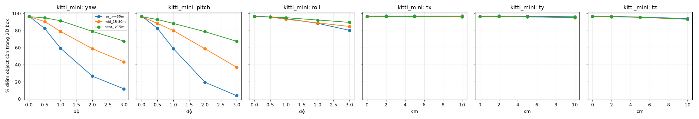
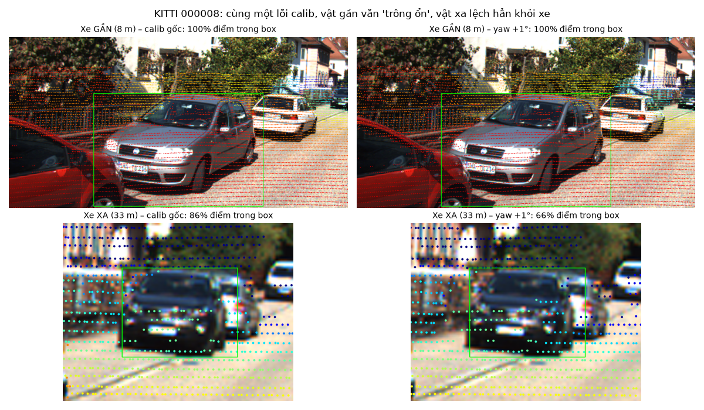
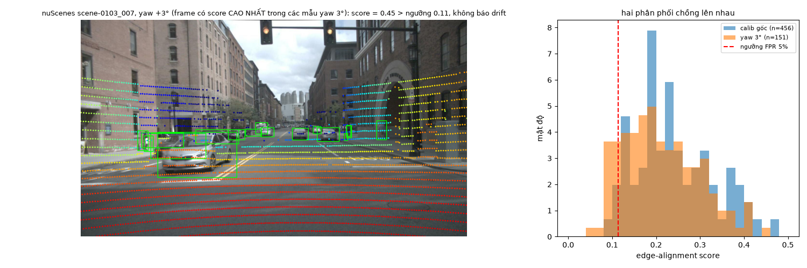

# Báo cáo Day 6: Độ nhạy của projection LiDAR-camera với calibration drift

- **Họ tên:** Ngô Đức Chung
- **MSSV:** 2A202602985 (phải trùng với MSSV trong tên repo `<HoVaTen>-<MSSV>-Track4-Day21`)
- **Lớp:** [ĐIỀN]
- **Link repo:** https://github.com/chung170703/NgoDucChung-2A202602985-Track4-Day21
- **Topic:** A — LiDAR-camera projection QA
- **Dataset:** data/synthetic, data/kitti_mini, data/nuscenes_mini_subset
- **Các frame đã dùng:** data/synthetic `000000` (test tay); data/kitti_mini toàn bộ 20 frame (`000001` … `000061`; overlay demo `000019`, `000011`, `000004`; failure `000008`); data/nuscenes_mini_subset toàn bộ 80 frame (`scene-0103_000..039`, `scene-1094_000..039`; overlay demo `scene-0103_010`; failure `scene-0103_007`)

## 1. Claim

**Lệch yaw 1° làm hơn 10% điểm LiDAR của một xe ở ≥ 30 m rơi ra khỏi 2D box của xe đó (KITTI: 96.9% → 59.2%, −37.7 điểm %; nuScenes: 99.6% → 87.5%, −12.1), trong khi ở < 15 m mức giảm chỉ ~5 điểm %. Tịnh tiến 10 cm gần như không đổi gì (≤ 3.2 điểm %). Nhưng không có label thì drift 1° chỉ phát hiện được khi gộp ~10 frame (edge-alignment score: 51% mẫu KITTI bị báo, 29% ở nuScenes); một frame đơn lẻ thì không đủ (17.5%).**

## 2. Evidence

Metric chính (`pct_in_box`): với mỗi object, lấy các điểm LiDAR nằm trong 3D box GT (dựng từ calib gốc), chiếu bằng calib đã perturb, đo % điểm còn trong 2D box label; lấy trung bình theo object, chia theo khoảng cách. Chỉ giữ object có ≥ 8 điểm và ≥ 80% điểm trong box ở calib gốc (loại object bị cắt ở mép ảnh; nếu không, baseline chỉ ~54% ở vật gần). Mỗi mức perturb lấy đối xứng ±, một trục mỗi lần, các trục còn lại giữ nguyên. Sweep không có yếu tố ngẫu nhiên nên chạy lại cho đúng cùng số (đã kiểm tra bằng `cmp`); phần gộp k frame dùng `seed=0`.

**Bảng 1: % điểm object còn trong 2D box theo mức drift** (`results/calib_sweep.csv`). Số object (gần/vừa/xa): KITTI 21/33/37, nuScenes 69/187/36.

| Dataset | Perturb | Gần < 15 m | Vừa 15–30 m | Xa ≥ 30 m |
|---|---|---|---|---|
| KITTI | gốc | 96.2 | 96.3 | 96.9 |
| KITTI | yaw 0.5° | 94.9 | 90.5 | 82.3 |
| KITTI | **yaw 1°** | 91.4 | 78.9 | **59.2** |
| KITTI | yaw 2° | 79.1 | 58.8 | 26.7 |
| KITTI | yaw 3° | 67.7 | 43.4 | 11.8 |
| KITTI | pitch 1° | 88.3 | 79.9 | 58.9 |
| KITTI | roll 1° / 3° | 95.0 / 89.6 | 93.2 / 84.8 | 94.0 / 80.3 |
| KITTI | tx / ty / tz 10 cm | 96.1 / 95.3 / 93.3 | 96.3 / 95.0 / 93.3 | 97.0 / 96.1 / 94.0 |
| nuScenes | gốc | 97.6 | 98.3 | 99.6 |
| nuScenes | **yaw 1°** | 92.3 | 88.8 | **87.5** |
| nuScenes | yaw 3° | 61.5 | 54.9 | 37.4 |
| nuScenes | roll 1° / 3° (*) | 90.1 / 69.5 | 83.8 / 40.0 | 75.6 / 16.2 |
| nuScenes | tx / ty / tz 10 cm | 97.1 / 97.5 / 94.4 | 97.7 / 98.2 / 95.3 | 99.3 / 99.6 / 98.6 |

(*) Trục LiDAR của nuScenes khác KITTI (x sang phải, y về phía trước), nên "roll" quanh x của LiDAR nuScenes tương ứng với pitch của camera; vì vậy hai dataset nhạy ở các trục có tên khác nhau. Với tịnh tiến 10 cm, % điểm trong FOV gần như không đổi (`pct_baseline_fov_kept` ≥ 99.2%).

**Bảng 2: phát hiện drift không cần label bằng edge-alignment score (yaw)** (`results/alignment_score.csv`). Ngưỡng = phân vị 5% của score ở calib gốc cùng dataset, tức báo động giả ~5%.

| Dataset | Yaw | Score trung bình | Phát hiện: 1 frame | Phát hiện: TB 10 frame | Phát hiện: baseline "% điểm trong FOV" |
|---|---|---|---|---|---|
| KITTI | 0° | 0.559 | 5.0% | 5.3% | 5.0% |
| KITTI | 0.5° | 0.536 | 12.5% | 18.7% | 7.5% |
| KITTI | 1° | 0.511 | 17.5% | **50.7%** | 7.5% |
| KITTI | 2° | 0.488 | 17.5% | 79.0% | 7.5% |
| KITTI | 3° | 0.476 | 20.0% | 97.3% | 5.0% |
| nuScenes | 1° | 0.210 | 12.5% | 29.0% | 5.6% |
| nuScenes | 3° | 0.211 | 13.1% | 19.7% | 4.4% |

- So sánh 2 cấu hình (`results/alignment_score_ratio015.csv`, chỉ KITTI): `ratio=0.15` (chọn nhiều điểm biên độ sâu hơn) phát hiện yaw 1° ở mức 12.5% (1 frame) / 43.3% (TB 10 frame), kém `ratio=0.3` (17.5% / 50.7%). Cấu hình `ratio=0.3` được chọn sau khi thử vài tổ hợp σ/ratio trên chính các frame này, nên số hơi lạc quan. Metric "% điểm trong FOV" gần như vô dụng (5–7.5%, ngang mức báo động giả), kém hẳn score biên.
- Pitch: TB 10 frame phát hiện 90% ở 1° (KITTI). Roll yếu hơn (28% ở 1°). Tịnh tiến ≤ 10 cm: không phát hiện được (ty 10 cm: 10%).
- Latency của score (bỏ lần đầu, 20 lần, `results/alignment_latency.csv`; CPU Apple Silicon, Python 1 luồng, OpenCV 5.0.0): KITTI (120k điểm) p50 = 5.3 ms, p95 = 5.7 ms; nuScenes (35k điểm) p50 = 2.1 ms, p95 = 2.5 ms. Tiền xử lý ảnh (Canny + distance transform) p50 = 1.6 / 5.1 ms, chỉ làm một lần mỗi ảnh.
- Hạn chế: chỉ 20 frame KITTI, nhóm "xa" của nuScenes chỉ có 36 object, ngưỡng score được hiệu chỉnh và đánh giá trên cùng dataset.

Ảnh demo overlay với calib gốc nằm trong `results/figures/`: xe rất gần (`overlay_000019_*`), cảnh trung bình (`overlay_000011_*`), xe xa > 50 m (`overlay_000004_*`), nuScenes (`overlay_scene-0103_010_*`). Biểu đồ: `calib_sweep_kitti_mini.png`, `calib_sweep_nuscenes_mini_subset.png`, `alignment_score_kitti_mini.png`, `alignment_score_nuscenes_mini_subset.png`.




## 3. Failure case

**fail_01: cùng một lỗi yaw 1°, xe gần vẫn "trông ổn", xe xa lệch hẳn (lớp Geometry/Metric).** Trên KITTI `000008`, xe cách 7.9 m vẫn có 99.6% → 99.7% điểm trong box, còn xe cách 33.2 m tụt 86.3% → 65.8%, và điểm LiDAR trượt sang bên phải thân xe (ảnh dưới). Nguyên nhân: sai số góc nhân với khoảng cách (1° ≈ 1.7 cm mỗi mét, tức ≈ 58 cm ở 33 m so với ≈ 14 cm ở 8 m), trong khi vật ở xa lại nhỏ trên ảnh. Hệ quả: quy trình kiểm tra calib chỉ nhìn vật gần (hoặc mặt đường) sẽ cho PASS dù calib đã hỏng ở tầm xa, đúng nơi ADAS cần quyết định sớm. Cách phát hiện/khắc phục: báo metric theo từng dải khoảng cách, đặc biệt ≥ 30 m, và ưu tiên cảnh có cột/xe ở xa khi kiểm tra calib.



**fail_02: score không phát hiện drift trên nuScenes (lớp Metric; nguyên nhân gốc là cách biểu diễn dữ liệu).** Với yaw 3° (khoảng 66 px lệch ngang trên ảnh 1600 px), 86.1% mẫu có score trên ngưỡng 0.113 nên không bị báo. Hai phân phối chồng lên nhau, và score thậm chí không đơn điệu (TB 10 frame: 29.7% ở 2°, 19.7% ở 3°). Nguyên nhân gốc: LiDAR 32 beam thưa chỉ cho ~53 (ban ngày) / ~116 (ban đêm) điểm biên độ sâu mỗi frame, so với ~2100 ở KITTI (64 beam), nên score nhiễu (std 0.09, lớn hơn mức giảm ~0.03). Thêm nữa score bão hoà: khi lệch quá vài σ (4 px) thì mọi mức lệch đều về "mức ngẫu nhiên" (baseline nuScenes chỉ 0.24), nên không phân biệt được 1° với 3°. Ảnh chụp frame `scene-0103_007`, là frame có score cao nhất trong các mẫu yaw 3° (chọn để minh hoạ giới hạn, không đại diện; con số đại diện là 86.1%).



**Ghi nhận thêm (lớp Time, `results/ego_motion_time_offset.csv`):** trên nuScenes camera chụp muộn hơn LiDAR trung bình 35.6 ms. Nếu tắt bù chuyển động xe, điểm LiDAR lệch tương đương dịch 0.22 m (tối đa 0.45 m, xe ~6 m/s), nhưng % điểm trong box chỉ giảm 82.5% → 80.5% và score 0.241 → 0.234, tức nằm trong nhiễu. Lý do: xe chạy thẳng nên dịch dọc trục camera ít đổi pixel (khớp với kết quả tx ≤ 10 cm ở Bảng 1). Nghĩa là lỗi đồng bộ thời gian không thể phân biệt với lỗi calib bằng các metric ở đây, và sẽ lộ rõ hơn khi xe vào cua hoặc có vật chuyển động ngang (chưa đo trong bài này).

## 4. Khuyến nghị nếu triển khai thật

Use-case: ADAS/xe tự hành dùng LiDAR + camera trước (fusion hoặc gán nhãn). Một cú va chạm nhẹ vào bracket cảm biến có thể làm lệch ~1° mà không ai biết; theo kết quả trên, ở ≥ 30 m lỗi này đã làm mất 12–38% điểm khỏi object, nhưng ở < 15 m gần như không thấy.
- **Giám sát calibration liên tục, không cần label:** chạy edge-alignment score (~5 ms/frame trên CPU, nhẹ) nhưng phải gộp cửa sổ khoảng 10 frame (≈ 1 s) mới phát hiện đáng kể (51% ở yaw 1°, 90% ở pitch 1° trên KITTI). Đánh đổi: phản hồi chậm hơn ~1 s; hạ báo động giả thì tỉ lệ phát hiện thấp đi. Đặt ngưỡng theo từng xe/sensor, không dùng chung (nuScenes baseline 0.24 so với KITTI 0.56).
- **Không dùng riêng một metric:** "% điểm trong FOV" không phát hiện được drift; metric phải phân theo khoảng cách (≥ 30 m).
- **Chỉ số cần ghi log khi chạy thật:** score từng frame và trung bình trượt 10 frame; số điểm biên độ sâu (`n_edge_pts`) để biết score còn đáng tin hay không (nuScenes chỉ ~53–116); % điểm trong FOV; độ lệch thời gian LiDAR–camera (ms) và tốc độ xe; tín hiệu IMU/rung để nghi ngờ va chạm; khi có detector thì % điểm vào box theo khoảng cách.
- **Khi score tụt:** kích hoạt kiểm tra có chủ đích (cảnh có cột/biển báo ở xa) trước khi tin vào fusion; chưa tự bù cho tới khi loại trừ lỗi thời gian (Time) vì hai lỗi trông giống nhau.
- **Bước tiếp theo:** thử trên log thật nhiều cảnh (đường cao tốc, ban đêm), đo khi xe vào cua để tách lỗi Time khỏi Geometry, và perturb nhiều trục cùng lúc.

## 5. Cách chạy lại

Các lệnh tái tạo lại toàn bộ kết quả từ repo sạch (chạy từ thư mục gốc, vài phút trên CPU laptop).

```bash
python -m venv .venv && source .venv/bin/activate && pip install -r requirements.txt
python tools/verify_data.py --data-root data/kitti_mini
python tools/verify_data.py --data-root data/nuscenes_mini_subset

# Demo overlay (CP2)
python -m starter.projection --data-root data/synthetic --frame 000000
python -m starter.projection --data-root data/kitti_mini --frame 000019
python -m starter.projection --data-root data/kitti_mini --frame 000011
python -m starter.projection --data-root data/kitti_mini --frame 000004
python -m starter.projection --data-root data/nuscenes_mini_subset --frame scene-0103_010

# Thí nghiệm chính (CP3), Bảng 1: results/calib_sweep.csv + calib_sweep_*.png
python -m src.calib_sweep --data-root data/kitti_mini data/nuscenes_mini_subset

# Edge-alignment score, Bảng 2: results/alignment_score.csv, alignment_score_frames.csv, alignment_score_*.png
python -m src.alignment_score --data-root data/kitti_mini data/nuscenes_mini_subset
python -m src.alignment_score --data-root data/kitti_mini --ratio 0.15 --out-prefix results/alignment_score_ratio015 --fig-dir /tmp
python -m src.alignment_score --data-root data/kitti_mini data/nuscenes_mini_subset --latency   # results/alignment_latency.csv

# Failure case (CP4): fail_01, fail_02, failure_cases.csv, ego_motion_time_offset.csv (chạy sau alignment_score)
python -m src.failure_cases
```

Mỗi script trong `src/` có `--help`. Lệnh `--ratio 0.15` cũng sinh `results/alignment_score_ratio015_frames.csv` (không dùng, có thể xoá). Số liệu latency phụ thuộc máy nên sẽ khác chút khi chạy lại; các số còn lại phải trùng khớp.

## 6. Khai báo sử dụng AI

| Công cụ | Dùng cho việc gì | Bạn đã kiểm chứng thế nào |
|---|---|---|
| Claude Code (Claude Sonnet 5.5) | Đọc tài liệu repo; viết 2 hàm `velo_to_cam`, `cam_to_image`; viết code trong `src/` (sweep, alignment score, failure cases); soạn báo cáo | Test tay điểm `(10, 0, 0)` cho `z_cam = 9.727`, pixel `(614.0, 175.0)` đúng yêu cầu CP2; test điểm NaN/Inf/sau camera bị loại; nhìn ảnh overlay thấy điểm khớp xe/người/mặt đường; phát hiện và sửa metric (baseline 54% do object bị cắt mép ảnh); chạy lại sweep và `cmp` hai file CSV giống hệt; đối chiếu số trong báo cáo với CSV trong `results/`. |
